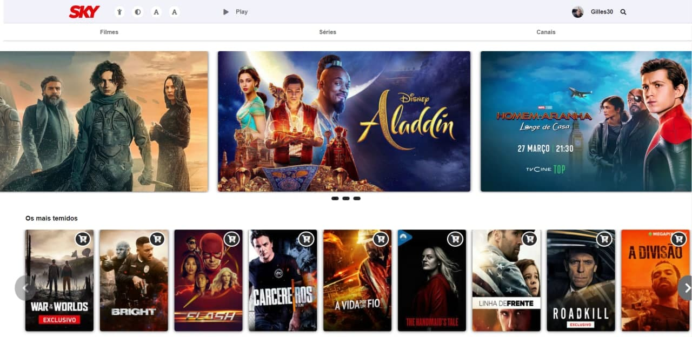
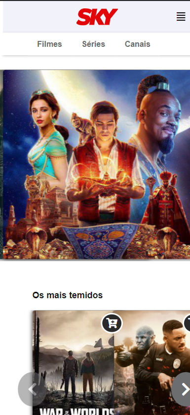

<p align="center"> Lorison Gilles Dev 🚀</p>

<p align="center">
   
</p>

<p align="center">	
   <a href="https://www.linkedin.com/in/lorison-gilles/">
      
   </a>
  

  <a href="https://github.com/Gilles30/GoDirect/commits/main">
    
  </a> 
  
  <a href="https://github.com/Gilles30/GoDirect/stargazers">
    
  </a>
</p>

> <p align="center"> :rocket: For this project, a clone of the DirectGo page was created to present my skills for SKY </p>

<p align="center">
    <a href="README.md">English</a>
    ·
    <a href="README-pt.md">Portuguese</a>
 </p>

<div align="center">
  <sub>The DirectGo SKY. Built with ❤︎ by
    <a href="https://github.com/Gilles30">Lorison Gilles</a> and
    <a href="https://github.com/Gilles30/GoDirect/">
      contributors
    </a>
  </sub>
</div>

# :pushpin: Table of Contents

- [Demo Website](#eyes-demo-website)
- [Technologies](#computer-technologies)
- [Features](#rocket-features)
- [How to Run](#construction_worker-how-to-run)
- [Found a bug? Missing a specific feature?](#bug-issues)
- [Contributing](#tada-contributing)
- [License](#closed_book-license)

<h2 align="left"> 📥 Layout available for download at: </h2>

### Web Screenshot

<div>
   
</div>

### Mobile Screenshot

<div>
   <h3> Mobile project under development </h1>
   
</div>

# :eyes: Demo Website

You can acess the website at:  
👉 demo: https://go-direct.vercel.app/

[](https://go-direct.vercel.app/)

# :computer: Technologies

This project was made using the follow technologies:

- [HTML](https://developer.mozilla.org/pt-BR/docs/Web/HTML)
- [CSS](https://developer.mozilla.org/pt-BR/docs/Web/CSS)
- [AXIOS](https://axios-http.com/)
- [Node.JS](https://nodejs.org/en/)
- [JQuery](https://jquery.com/)
- [Slick](https://kenwheeler.github.io/slick/)
- [Express](https://expressjs.com/)

# :rocket: Features

- Page for movies views.
- App to connect API to SKY.

# :construction_worker: How to run

```bash
# Clone Repository
$ git clone https://github.com/Gilles30/GoDirect.git
```

### 💻 Run Web Project

```bash
  # Enter Directory:
  $ cd GoDirect

  # Install Dependencies
  $ yarn

  # Double-click on the index.html file
  $ index.html

```

# :bug: Issues

Feel free to **file a new issue** with a respective title and description on the the [GoDirect](https://github.com/Gilles30/GoDirect/issues) repository. If you already found a solution to your problem, **i would love to review your pull request**!

# :tada: Contributing

Check out the [contributing](./CONTRIBUTING.md) page to see the best places to file issues, start discussions and begin contributing.

## 🤝 Contributing

Follow the steps below to contribute:

1. _fork_ the project (<https://github.com/Gilles30/GoDirect>)

2. Clone your _fork_ to your machine (`git clone https://github.com/Gilles30/GoDirect.git`)

3. Create a _branch_ to carry out your modification (`git checkout -b feature/name_new_feature`)

4. Add your modifications and do the _commit_ (`git commit -m "Describe your modification"`)

5. _Push_ (`git push origin feature/name_new_feature`)

6. Create a new _Pull Request_

7. Okay, now just wait for the analysis 🚀

# :closed_book: License

Released in 2022 :closed_book: License

Made with love by [Lorison Gilles](https://vercel.com/gilles30) 🚀.
This project is under the [MIT license](./LICENSE).

Give a ⭐️ if this project helped you!
